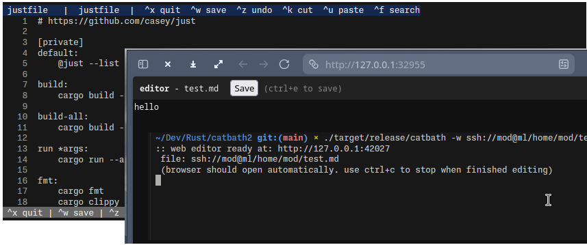

# catbath

[](https://github.com/skorotkiewicz/catbath/actions)
[](https://github.com/skorotkiewicz/catbath/releases)
[](https://github.com/skorotkiewicz/catbath/releases)

A tiny terminal text editor in Rust. Single binary, zero dependencies.



## Usage

```
editor [-g|-w] <file>
```

- `-g` GUI mode (TUI provided)
- `-w` Web mode (browser editor)
- `ssh://user@host/path/file.txt` for remote editing

## Keys

- `^Q` quit
- `^S` save
- `^Z` undo
- `^K` cut line (repeat for multi-line)
- `^U` paste cut lines
- `^F` search

## Build

```sh
cargo build --release
# or
yay -S catbath
```
